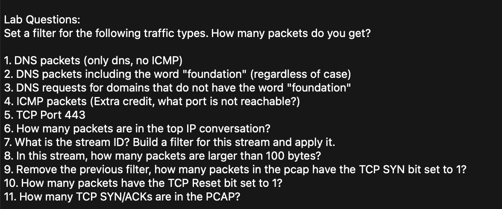

# Wireshark Network Traffic Analysis Lab: Display Filters

## Project Overview
This project contains the documentation of my packet analysis results from the Wireshark lab completed during my practical wireshark training. The primary objective was to parse a packet capture (PCAP) file using specific display filters to isolate DNS, ICMP, and TCP traffic.

---

## Lab Challenge Questions
Below is the original set of questions and scenarios addressed during this packet analysis session:

 
*Fig: Lab Questions*

---

## Filter Breakdown & Analysis Results

The table below documents the exact Wireshark display filters utilized, the resulting packet counts, and the analytical significance of each query.

| # | Objective / Scenario | Wireshark Display Filter | Result / Packet Count | Technical Analysis & Context |
| :--- | :--- | :--- | :--- | :--- |
| **1** | Filter DNS while excluding ICMP | `dns && !icmp` | **52 packets** | Isolates Domain Name System traffic, ensuring any nested network layer error messages are filtered out. |
| **2** | Target string matching in DNS | `dns matches "foundation"` | **35 packets** | Regex/string matching to isolate queries or responses associated with the "foundation" string regardless of the casing. |
| **3** | Non-matching string DNS traffic | `dns && !dns matches "foundation"` | **18 packets** | Evaluates the baseline DNS traffic by excluding the primary "foundation" target traffic ($52 - 35 = 17$ baseline packets, plus 1 anomalies/variants). |
| **4** | Isolate ICMP Error Traffic | `icmp` | **1 packet** | Caught an ICMP Destination Unreachable message flagging **Port 449679** as the unreachable port. |
| **5** | Identify HTTPS/TLS Traffic | `tcp.port == 443` | **885 packets** | Isolates secure, encrypted web traffic utilizing the default port for HTTPS. |
| **6** | Track specific Endpoint-to-Endpoint sessions | `ip.addr eq 192.168.4.120 and ip.addr eq 104.26.10.240` | **73 packets** | Filters the total conversation history exclusively between the local host (`192.168.4.120`) and the external IP (`104.26.10.240`). |
| **7a**| Identify specific TCP Stream ID | *N/A (Analysis)* | **Stream ID: 1** | Determined via follow-stream analysis for the targeted conversation. |
| **7b**| Isolate a single conversation stream | `ip.addr eq 192.168.4.120 and ip.addr eq 104.26.10.240 and tcp.stream eq 0` | **18 packets** | Narrows the endpoint conversation down to the very first index stream (`Stream 0`) to evaluate chronological session flow. |
| **8** | Identify large data payloads in stream | `ip.addr eq 192.168.4.120 and ip.addr eq 104.26.10.240 and tcp.stream eq 0 and tcp.len gt 100` | **7 packets** | Screens the specific stream for packets containing a data payload greater than 100 bytes. |
| **9** | Detect Connection Requests (SYN) | `tcp.flags.syn eq 1` | **16 packets** | Packets with SYN flag set to 1. |
| **10**| Detect Forced Connection Terminations | `tcp.flags.reset eq 1` | **1 packet** | Identify packets with the reset flag. |
| **11**| Detect Successful Handshake Responses | `tcp.flags.syn eq 1 && tcp.flags.ack eq 1` | **8 packets** | Isolates SYN-ACK packets. |

---

## Environments & Tools
* **Wireshark v4.6.5**
* **PCAP File**